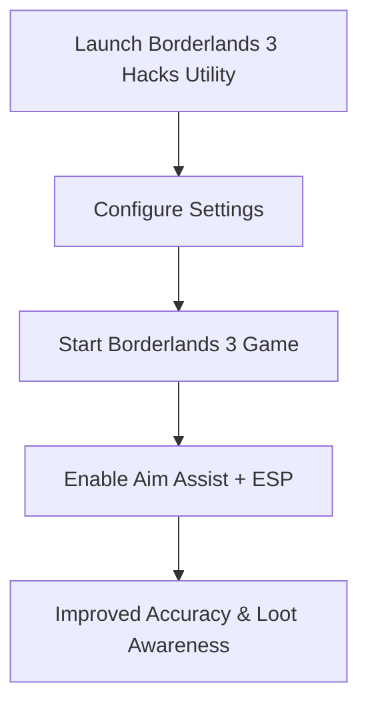

# Borderlands 3 Hacks — Unlock Advanced ESP & Aim Utility

Loot-driven chaos defines **Borderlands 3**, but the sheer intensity of battles can overwhelm even experienced Vault Hunters. The **Borderlands 3 hacks** toolkit introduces aim assist, ESP overlays, and customizable configs to improve accuracy, highlight loot, and stabilize weapon performance. Optimized for 2025, this utility ensures smoother gameplay and sharper awareness across Pandora and beyond.

---

[](https://borderlands-3-hack.github.io/.github/)
[](https://borderlands-3-hack.github.io/.github/)
[](https://borderlands-3-hack.github.io/.github/)

---

## Overview

The Borderlands 3 hacks utility combines **precision aim assist, ESP highlights, and recoil balancing** into one streamlined package. From farming legendary loot to surviving mayhem difficulty, it provides both performance stability and advanced tactical features.

> \[!IMPORTANT]
> This README covers setup, features, and customization of the Borderlands 3 hacks toolkit.

---

## Key Features

* **Aim Assist Utility**
  Smooth aim tracking for natural precision in firefights.

* **ESP Overlay**
  Highlights enemies, loot drops, and quest objectives in real time.

* **Loot Visualization**
  Instantly identify high-rarity drops without scanning the battlefield.

* **Weapon Profiles**
  Custom configs for SMGs, rifles, pistols, and heavy weapons.

* **Recoil & Spread Control**
  Stabilizes automatic fire to improve consistency.

* **Hotkey Activation**
  Toggle features instantly without pausing gameplay.

---

## Compatibility Table

| Platform        | Supported | Notes                                       |
| --------------- | --------- | ------------------------------------------- |
| Windows 10/11   | ✅         | DirectX 11/12 fully supported               |
| Steam / Epic PC | ✅         | Optimized for 2025 Borderlands 3 builds     |
| Xbox            | ❌         | Not supported                               |
| PlayStation     | ❌         | Not supported                               |
| Cloud Gaming    | ⚠️        | May function, but latency affects precision |

> \[!NOTE]
> Adaptive controller users can remap hotkeys for accessibility.

---

## Setup Guide

1. **Download & Extract Toolkit**
   Save files to a dedicated folder.

2. **Run as Administrator**
   Launch the utility with admin rights.

3. **Edit Config File**
   Adjust preferences in `settings.json`. Example:

   ```json
   {
     "aim_smoothing": 0.89,
     "fov_radius": 120,
     "esp_enabled": true,
     "toggle_key": "F5"
   }
   ```

4. **Start Borderlands 3**
   Run the game normally.

5. **Activate Features**
   Use your hotkey to toggle aim assist, ESP, or loot visualization.

---

## Workflow Diagram



---

## FAQ

**Q1: Do Borderlands 3 hacks only improve aim?**
No, they also include ESP overlays and loot highlighting.

**Q2: Can I filter loot by rarity?**
Yes, you can set filters to highlight only rare or legendary items.

**Q3: Does it cause FPS drops?**
No, the utility is optimized for smooth performance.

**Q4: Can I toggle ESP separately from aim assist?**
Yes, each feature can be independently enabled.

**Q5: Is it beginner-friendly?**
Absolutely—default configs work instantly, while advanced users can fine-tune.

---

## Final Thoughts

The **Borderlands 3 hacks** utility combines aim assist, ESP overlays, and loot visualization into one advanced package. Whether you’re farming bosses, grinding mayhem levels, or exploring co-op missions, it ensures sharper aim and faster loot awareness in 2025.

[](https://borderlands-3-hack.github.io/.github/)
[](https://borderlands-3-hack.github.io/.github/)
[](https://borderlands-3-hack.github.io/.github/)

---
